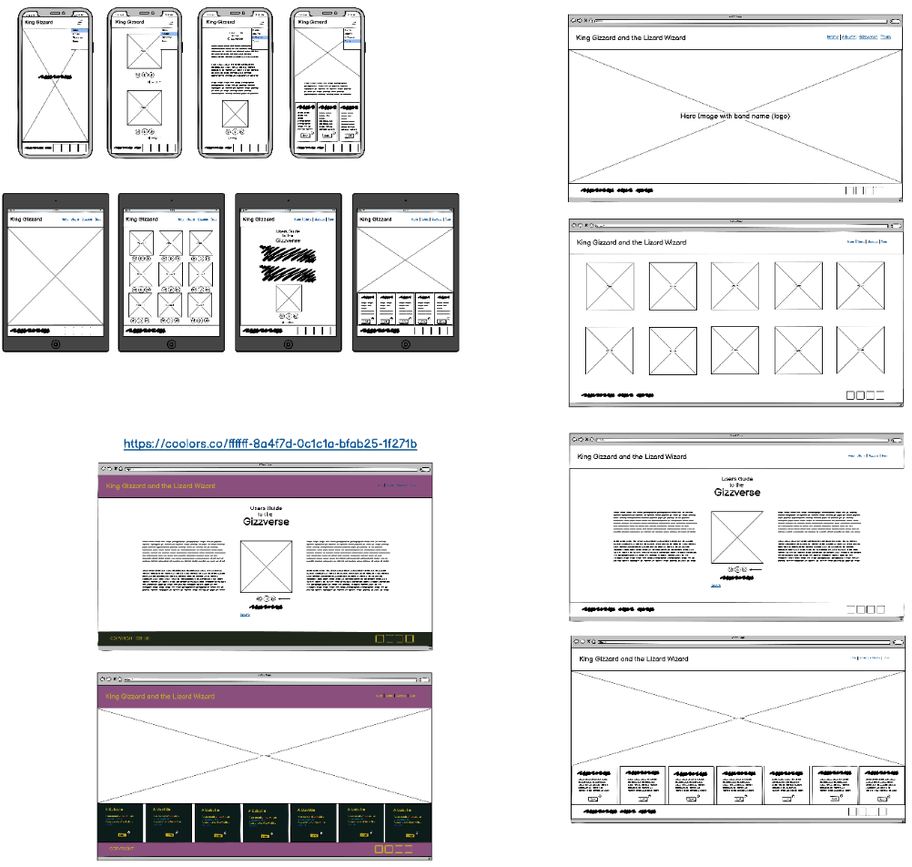

# King Gizzard and the Lizard Wizard

https://alienatedsoftware.github.io/First-Milestone-Project-King-Gizzard/

## Table of Contents

1. [Introduction](#Introduction)
2. [UX](#UX)
    1. [Ideal User Demographic](#Ideal-User-Demographic)
    2. [User Stories](#User-Stories)
    3. [Development Planes](#Development-Planes)
    4. [Design](#Design)
3. [Features](#Features)
    1. [Design Features](#Design-Features) 
    2. [Existing Features](#Existing-Features)
    3. [Features to Implement in the future](#Features-to-Implement-in-the-future)
4. [Issues and Bugs](#Issues-and-Bugs)
5. [Technologies Used](#Technologies-Used)
     1. [Main Languages Used](#Main-Languages-Used)
     2. [Additional Languages Used](#Additional-Languages-Used)
     3. [Frameworks, Libraries & Programs Used](#Frameworks,-Libraries-&-Programs-Used)
6. [Testing](#Testing)
     1. [Testing.md](TESTING.md)
7. [Credits](#Credits)
     1. [Content](#Content)
     2. [Media](#Media)
     3. [Code](#Code)
***

## Introduction

Project - User-Centric Frontend Development - Code Institute

This project will act as the home for the music band - King Gizzard and the Lizard Wizard. Its focus of the website is to target fans and potentional fans to learn relevent information about the band, to introduce them to their music and members.

King Gizzard and the Lizard Wizard, commonly called - "Gizzard" (King Gizz, The Gizz) for short, are an Australian rock band formed in 2010. The band consists of Stu Mackenzie (vocals, guitar, bass, keyboards, flute), Ambrose Kenny-Smith (vocals, harmonica, keyboards), Cook Craig (guitar, bass, keyboards, vocals), Joey Walker (guitar, bass, keyboards, vocals), Lucas Harwood (bass, keyboards), Michael Cavanagh (drums, percussion), and Eric Moore (ex-drummer).
They built their fame for their explict use of exploring multiple genres, and their lighting energetic live shows. 
Having released 17 albums since they formed, and released 5 albums in a single year back in 2017. Gizzard sure knows how to deliever to their fans with over the top musicical entertainment.

The propose behind this project is to help build reputation for the band and increase its fanbase. Highlighting their achievements and act as a selling point for their merch and tickets for their tours/gigs.

This is my first of four Milestone Porjects that I must complete during the Full Stack Development Porgram over at Code Institute.

The primarialy requirements for this milestone is to make a static front end website using **HTML** and **CSS** with the _optional_ use of **Bootstrap** Frameworks.

[Back to top](#King-Gizzard-and-the-Lizard-Wizard)

## UX

### Ideal User Demographic

The ideal users of this website are:

- Passionate music lovers
- Potentional fans
- Current fans
- Event bookers

### User Stories

#### Music lovers / New fans

1. As a music lover / new fan, I want to explore the art of music and discover the content of Gizzard.
2. As a music lover / new fan, I want to be able to easily navigate through the website to be able to find relevant content.
3. As a music lover / new fan, I want to be able to learn more about this partiular band, their members and where they originated.
4. As a music lover / new fan, I want to connect through their social links in order to keep up with their latest and upcoming projects, as well as their day-to-day life.
5. As a music lover / new fan, I want to be able to explore their music, by listening to some of their songs.

#### Current fans

1. As a current fan, I want to easily be able to find information about their upcoming live events and gigs, in order to secure tickets online.
2. As a current fan, I want to be able to navigate through their music to listen and enjoy their content.

#### Event bookers

1. As an event booker, I want easily be able to navigate the band's upcoming event details.
2. As an event booker, I want  be able to securely book tickets online.

### Development Planes

In order to create an engaging website, the developer worked closely with the bands' movement and story to make out the required functionality of the site and how it would answer the user stories.

#### Strategy
This website will be focused on the following target audiences:
- **Roles:**
     - New Fans
     - Current Fans
     - Event Bookers
     - Passionate Music Lovers

- **Demographic:**
     - 13 - 30+ year olds
     - Under & Post Graduate students
     - Fans of psychedelic & rock music 

- **Psychographics:**
     - Personality & Attitudes:
          - Youthful
          - Adventurous
     - Values:
          - Classic & modern psychedelic lifestyle
          - Leaning towards the values of experimental bizarre music
     - Lifestyles:
          - Music Lovers
          - Interested in the "Trippy" culture

The website needs to enable the **user** to:
- Retrieve desired information:
     - Biographical information
     - Upcoming live events
     - Socials

The website needs to enable the **band** to:
- Develop an online presence 
- Provide an easily navigable website for users to find relevant information:
     - Events
     - Music
     - Biographical information

#### Scope
A scope was defined in order to clearly identify what needed to be done in order to align features with the strategy previously defined. This was broken into two categories:
- **Content Requirements**
     - The user will be looking for:
          - Biographic information
          - Media Articles
          - Upcoming gigs
          - Contact details
          - Social Links
          - Plugs for new music and video releases
- **Functionality Requirements**
     - The user will be able to:
          - Easily navigate through the site in order to find the information they want
          - Be able to find links to external sites in order to:
               - Purchase gig tickets
               - Find gig directions
               - Pre-save or save new music releases
          - Contact the artist directly through their chosen channel of communication

#### Wireframe

###  Design

#### Colour Scheme
The main colours used throughout the website are a mixture of Purple and Yellow.

The colour scheme is a reflection of the band's jazzy and acidic feel.

#### Typography
The pairing of the fonts [Roboto Condensed](https://fonts.google.com/specimen/Roboto+Condensed "Link to Roboto Condensed Google Font") and [RocknRoll One](https://fonts.google.com/specimen/RocknRoll+One "Link to RocknRoll One Google Font") is used throughout the website with Sans Serif as the fallback font in case of import failure. 

#### Imagery
The imagery is picked carefully to really capture the electric scene of the band. 

All imagery provides alternative text to be used in the event that the element cannot be rendered.

All copyright credit goes to King Gizzard and their labels. See [credits](#Credits)

[Back to top](#King-Gizzard-and-the-Lizard-Wizard)

## Features

### Navigation Bar

- Logo, clickable which will always take you to the home page.
- Nav links to take you to each of the pages. Only viewable on larger devices. 
- On Smaller to medium devices, the nav links collase into a 'burger' button which will display the nav links as a drop down once the burger button pressed.

### Home

- Carousel slide slow, showing fans the behind the scenes in the life of Gizzard, and the members of the band.
- About Us section, this acts as the biography for the band.
     - Awards section, an additional section that showcases the awards earned by the band. This section is responsive, acts as a side-by-side divs on larger screens but then acts as one on top of the other on smaller devices.
- Meet the band section, a responsive section for the band members for visitors to read and get to know each band member individually. On larger to medium screens will display 2 band members side-by-side on each row. On smaller screens it will display one band member per row.

### Albums Page

- Spotify album previews for fans to listen to some of the bands music, they will also be able to be sent directly to the official spotify playlists.
- Responsive layouts, this page is fully responsive from large to small screens. On large, it will display 4 albums per row. Medium will display either 2 - 3 depending on the size of the device, example; iPad vs iPad Pro. On small devices such as phones, there will be only one album displayed per row.

### Gizzverse

- A responsive card body with all the contents inside fully responsive for all device sizes to be easily accessible and readable for all users.

### Tours

- Background image of the band at a live show, capturing the scene of Gizzard and the fans experience.
- Callout Card, promoting users to sign up for an exclusive band deal for a discounted price on tour package. 
- Nav alert pop-up on medium devices or larger only. To help promote the exclusive deal on a tour package. Not viewable on smaller devices. 
- Multiple modal pop-ups for sign-ups and event booking.
- Responsive upcoming events section, which displays upto 4 future events on large screens, but then cuts down to one on the small device, only displaying the next upcoming event. This crops out an event to fit the screen depending on the screen size. 

### Footer

- Responsive copyright text, which crops on smaller devices. But expands on larger devices. Going from "Copyright © 2021 King Gizzard and the Lizard Wizard. All Rights Reserved" to "Copyright © 2021 K.G.".
- Social media icons which will link to the bands socials. 

## Technology used

### Languages Used
- [HTML5](https://en.wikipedia.org/wiki/HTML5 "Link to HTML Wiki")
- [CSS3](https://en.wikipedia.org/wiki/Cascading_Style_Sheets "Link to CSS Wiki")

### Frameworks Used
- [Bootstrap](https://getbootstrap.com/docs/4.4/getting-started/introduction/ "Link to Bootstrap page")
     - Bootstrap was used to implement the responsiveness of the site, using bootstrap classes.
- [Google Fonts](https://fonts.google.com/ "Link to Google Fonts")
    - Google fonts was used to import the fonts "Roboto Condensed" and "RocknRoll One" into the style.css file. These fonts were used throughout the project.
- [Font Awesome](https://fontawesome.com/ "Link to FontAwesome")
     - Font Awesome was used on all pages throughout the website to import icons for UX purposes.
- [Git](https://git-scm.com/ "Link to Git homepage")
     - Git was used for version control by utilising the GitPod terminal to commit to Git and push to GitHub.
- [GitHub](https://github.com/ "Link to GitHub")
     - GitHub was used to store the project after pushing
- [Balsamiq](https://balsamiq.com/ "Link to Balsamiq homepage")
     - Ba;samiq was used to create the wireframes during the design phase of the project.
- [Am I Responsive?](http://ami.responsivedesign.is/# "Link to Am I Responsive Homepage")
     - Am I Responsive was used in order to see responsive design throughout the process and to generate mockup imagery to be used.

## Testing

Based on the User Stories above, all users will be able to follow the flow of the website to find what they came for according to their stories. However they won't be able to actually fully book a ticket for their tours. This is just a milestone project, not an official website of the band.

Google developer tools was used manually to check and test the live project on all different screen sizes. Used multiple devices and feedback from family & friends who went to the deployed site on their devices.

## Issues and Bugs

**Navbar Bugs**
- Burger Button - Upon first implementing the "burger button" to have the navbar links collaspe into a single button for smaller devices. There was a bug that when users first opened the burger button to reveal all the nav links, the button would no longer close/collaspe. To address this issue, I had to delete a line of code as I linked an extra CDN for bootstrap which caused an interruption with the bootstrap package. 

- Fixed Position - There was an issue upon trying to have the Navbar have a fixed position so it will always remain on top of the screen no matter how far the user scrolls down. Implementing the fixed position using bootstrap meant that I had to use additional CSS to prevent the body of the website from being cropped/hidden by the navbar as the navbar would act as it if was sat on top of the content, rather than on top. Doing this required to add a padding-top by the number of pixels that the navbar is, in this case, 100px.

**Tour Page**
- Callout Sector - When this was implemented onto the site, the developer ran into an issue where the callout appeared on top of everything on the page, including the navbar. Completely eating the whole page. z-index was used to counter this issue, and allowed the callback to be set back behind the navbar, exactly how it should be. Hoever this caused another issue that caused the callout to be unclickable. This was because in the CSS, the absolute value was being used, which removes element from the DOM completely in terms of the normal flow. Removing the position: absolute from the CSS attributes fixed this issue entirely.

## Credits

All credits go the King Gizzard & The Lizard Wizard and it's members. All images are from their socials.

Credits to their music labels:
- Flightless
- Heavenly
- ATO
- Shock
- Castle Face
- Inertia Music